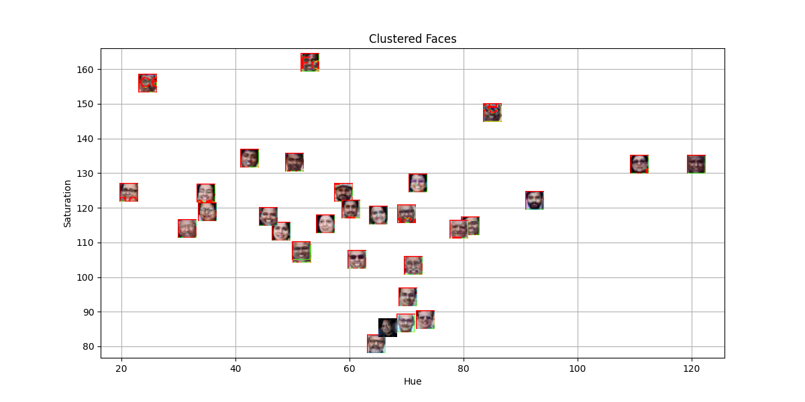
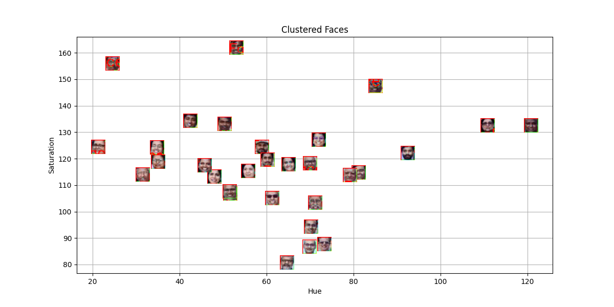
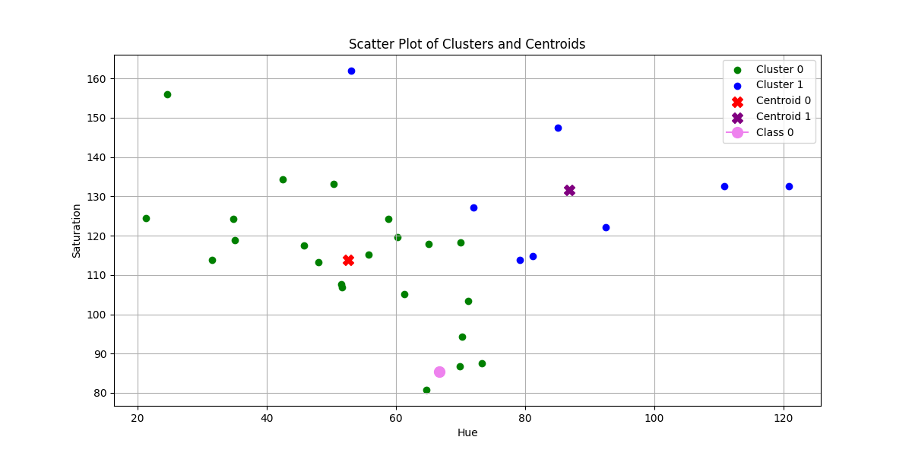

## Distance-Based Classification Report

### Author: Mohak Agarwala  
**ID:** U20230124

### Model Performance


### WandB Project View


### Clustered Plots
- **Without Template Image**  
  
- **After Adding Template Image**  
  

## Report

### 1. Common Distance Metrics in Classification
- **Euclidean Distance**: Measures straight-line distance.
- **Manhattan Distance**: Sum of absolute coordinate differences.
- **Minkowski Distance**: Generalizes Euclidean and Manhattan.
- **Chebyshev Distance**: Maximum coordinate difference.
- **Hamming Distance**: Measures differences in categorical data.

### 2. Real-World Applications
Used in image recognition, handwriting classification, medical diagnosis, fraud detection, anomaly detection, NLP, clustering, and segmentation.

### 3. Explanation of Distance Metrics
- **Euclidean**: \( d(x, y) = \sqrt{\sum (x_i - y_i)^2} \)
- **Manhattan**: \( d(x, y) = \sum |x_i - y_i| \)
- **Minkowski**: \( d(x, y) = (\sum |x_i - y_i|^p)^{1/p} \)
- **Chebyshev**: \( d(x, y) = \max(|x_i - y_i|) \)
- **Cosine Similarity**: \( \frac{x \cdot y}{||x|| \times ||y||} \)
- **Hamming**: Counts differing symbols in categorical data.

### 4. Role of Cross-Validation
Cross-validation prevents overfitting by splitting data into multiple folds, ensuring reliable performance estimation, aiding hyperparameter tuning, and improving model robustness.

### 5. Variance and Bias in KNN
- **Bias**: High for large K, leading to oversimplified decision boundaries.
- **Variance**: High for small K, making the model sensitive to noise.
- **Trade-off**: Optimal K balances flexibility and stability, avoiding both underfitting and overfitting.

```
Kaggle link: https://www.kaggle.com/code/mohakagarwala/notebooka0791e1fe5
```